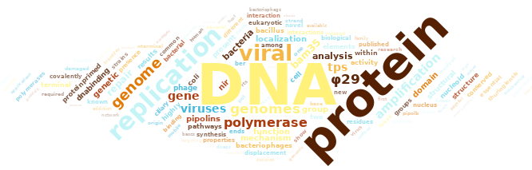
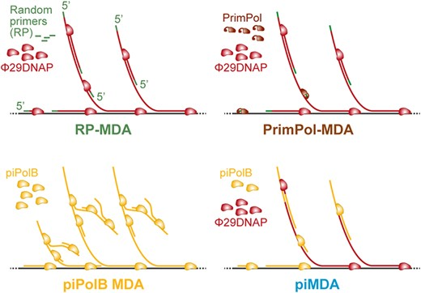

```{r}

```

[{fig-alt="Publications cloud from scholargoggler.com"}](https://scholargoggler.com/)

## Keep updated on our [𝕏](https://x.com/RnR_Lab) timeline.

## News about Papers, Blog posts, fellowships...

### March 19, 2026 - 🚀 Not one but two papers today!

#### **NEW Preprint 📜: A new biotech tool for massive gene discovery (with José A. Escudero [](https://x.com/jaegc "@JAEGC"))**

We’re excited to share a collaborative project that presents a new biotechnology tool designed for large‑scale gene discovery screens. This approach enables the high‑throughput recovery and analysis of gene from complex samples, opening the door to exploring vast reservoirs of functional diversity that standard genomic methods often overlook. By streamlining cassette capture and characterization, the method provides a powerful platform for uncovering novel genes, adaptive functions, and hidden metabolic capabilities across diverse microbial communities.

🔬 At the heart of this work are integrons, extraordinary diverse mobile genetic elements that act as natural gene‑assembly platforms in bacteria. Integrons capture, rearrange, and mobilize gene cassettes, driving rapid evolutionary innovation. In this [manuscript](https://www.biorxiv.org/content/10.64898/2026.03.17.712381v1) posted in bioRxiv, **Filipa Trigo da Roza** [](https://bsky.app/profile/filipatr.bsky.social "@filipatr.bsky.social"), from the [MBA lab](https://ucm.es/mbalab), develops and successfully applies two new screening pipelines, the *cassette gatherer* and the *cassette hunter*, to uncover the diversity of integron gene cassettes at unprecedented scale. Our group contributed the genomics and bioinformatics analysis, helping quantify cassette abundance, annotate functions, and map the organizational patterns within integron arrays. 

It’s been a pleasure to collaborate once again with colleagues whose creativity and energy make this kind of work truly enjoyable. Stay tuned—this tool will unlock many more discoveries to come.

👉 Check out the data‑analysis in our [ cassette_gatherer_hunter](https://github.com/mredrejo/cassette_gatherer_hunter) repository.

#### **Unexpected tolerance of *T. thermophilus* to genome to TnSeq insertions in bacterial Common Essential Genes (with Mario Mencía  [](https://x.com/mariomenciacab "@mariomenciacab"))**

We are delighted to share the publication of our new paper in [MicrobiologyOpen](https://onlinelibrary.wiley.com/doi/10.1002/mbo3.70207), the result of a thoroughly enjoyable collaboration with long‑time colleagues, rewarding on the personal side as it was scientifically. The study uses high‑resolution TnSeq mutagenesis to interrogate genome‑wide gene permissiveness in *Thermus thermophilus*, a model thermophilic bacterium that can grow in a temperature range of 65ºC to 75ºC. By generating and sequencing large libraries of random insertion mutants, the work uncovers a surprising tolerance to insertions even in genes traditionally thought to be part of the universal bacterial “essential core”, revealing a genomic landscape far more flexible than expected in this organism. 

We provided our genomics and bioinformatics expertise for the analysis of the TnSeq sequencing libraries, including mapping, normalization, insertion‑site quantification and the clustering of genome‑wide permissiveness profiles. In most bacterial TnSeq studies, insertion‑frequency distributions appear bimodal: a large group of genes tolerant to many insertions and a smaller subset of essential genes with almost no insertions (often enriched at gene ends). Strikingly, *Thermus thermophilus* showed a very different pattern, a unimodal curve, with only a few genes accumulating many insertions and a gradual, almost linear decline across the remaining genes. This unusual distribution makes the classical identification of essential genes extremely challenging.
Using a clustering‑based strategy, we were able to separate genes into two major groups—those with high and those with intermediate tolerance to insertions. This approach helped reveal unexpected patterns of gene disruption and highlighted how features such as redundancy in DNA‑repair pathways.
We then compared the results with core bacterial essential genes from various studies and with the Thermus gene expression pattern, finding no overall correlation. We propose that the intrinsic polyploidy and plasticity of the *Thermus* genome may buffer the effects of transposon insertions. These findings offer a more nuanced perspective on gene essentiality in extremophiles and open new possibilities for genetic engineering and evolutionary studies in high‑temperature bacterial models. Furthermore, we provide a novel perspective for Tn-seq screens and their interpretation regarding gene essentiality.


👉 Check out the full data‑analysis in a [repo](https://github.com/mredrejo/thermus_tnseq) and [GitHub pages site](https://mredrejo.github.io/thermus_tnseq/).


### July 30, 2025 - AEI Research Grant awarded!

We are very happy to just know that our National grant PID2024 has been awarded. This grant will support us for the following three years.


### November 5, 2024 - Our paper in UAM Gazette!

The Scientific Culture Unit at UAM ([Unidad de Cultura Científica, UCC](https://www.uam.es/uam/investigacion/cultura-cientifica)) help us go gain a broader difusion of our work and published a note about our recent paper (in Spanish): <https://www.uam.es/uam/investigacion/cultura-cientifica/noticias/bacterias->



This note has been posted in the UAM social media accounts and republished by other news portals, including versions in [Madrid+d](https://www.madrimasd.org/notiweb/noticias/identifican-elementos-geneticos-moviles-clave-defensa-contra-bacteriofagos?utm_campaign=notiweb-05112024&utm_medium=email&utm_source=mail-marketing#utm_source=notiweb_newsletter&utm_medium=email&utm_campaign=noti2_05nov2024) and a version in English at [MyScience](https://www.myscience.es/news/2024/identifican_elementos_geneticos_moviles_clave_para_la_defensa_contra_bacteriofagos-2024-uam) portal.

### October 15, 2024 - New Paper Alert!

We just published a terrific manuscript by Víctor on NAR!

::: {.callout-note icon="true"}
### [Pipolins are bimodular platforms that maintain a reservoir of defense systems exchangeable with various bacterial genetic mobile elements](https://academic.oup.com/nar/advance-article/doi/10.1093/nar/gkae891/7822304#google_vignette)
:::

#### What does it mean?

MGEs promote the spread of antimicrobial resistance, virulence, and defense genes, contributing to bacterial adaptation via genome dynamics. Several groups of plasmids and viruses encode mechanisms for autonomous or semi-autonomous DNA transfer. However, other MGEs also contribute to the high gene flux in bacterial genomes, relying on these elements or unknown mechanisms for mobilization, hindering analysis of their role in genome plasticity. These elements have been recently referred to as “hitchhikers” and can include mobilizable and non-mobilizable plasmids, and integrative elements ([Ares-Arroyo et al. 2024](https://doi.org/10.32942/X2R89M).).

Pipolins would possible be among the more enigmatic hitchers GMEs. Some years ago, we identified these elements as integrative elements with a patchy distribution in most major bacteria phyla and also in some mitochondria genomes. Here, in order to unveil the real extent of pipolins in Bacteria and analyze their diversity, Víctor performed a comprehensive screening of pipolins in bacterial genomes, analyzing their structure, gene content, and exchange rates with other MGEs. Using our tool [ExplorePipolin](mge.html#explorepipolin) ([Chuprikova et al. 2022](https://pubmed.ncbi.nlm.nih.gov/36699382/)), Pipolins were detected across bacterial phyla, being particularly abundant in Gammaproteobacteria (mainly in *Escherichia* and *Vibrio*), and also prevalent in several distant genera, such as *Aeromonas*, *Limosilactobacillus* or *Pseudosulfitobacter*. Most pipolins were integrative elements with direct repeats, sharing tRNA and genomic loci with other MGEs. Recombinase switching or loss allowed novel insertion sites and transition between integrative mobile elements (IME-pipolins) and plasmids (plasmid-pipolins).

Previous studies identified restriction-modification systems and other nucleic acid metabolism proteins in pipolins, alongside numerous genes with unknown functions. Here, we show that pipolins are enriched for defense systems, with over 15% of genes annotated by [PADLOC](https://github.com/padlocbio/padloc), compared to 1.5% and 3% in plasmids and conjugative integrative mobile genetic elements (ciMGEs), respectively. The pipolin structure, with minimal core genes and a large cargo module of defense genes, resembles other defense islands recently reported. Moreover, he performed the most comprehensive weighted gene relatedness ratio (wGRR, [Cury et al. 2018](https://pubmed.ncbi.nlm.nih.gov/29905872/)) analysis between integrated defense islands and extrachromosomal elements, disclosing frequent gene exchange between pipolins, phages, and ciMGEs, suggesting not only high abundance but also extensive horizontal transfer of defense genes.

Altogether, this study provides a detailed characterization of pipolins and proposes a two-speed mechanism for diversification and mobilization of bacterial defense genes at the population level. Thus, we hypothesize that pipolins exemplify a class of defense "hitchhikers" can accumulate quickly a large orthogonal reservoir of defense systems, favored by their parasitic mobility. The interaction with new, autonomous MGEs might trigger these defense factors or, when immune, would eventually allow the acquisition of new defense genes and potentially mobilize the “hitchhikers”, suggesting the existence of complementary defense gene flow mechanisms in bacteria populations.

### November 23, 2023 - Modesto Promoted to PPL (Associate Professor)

We are happy to share that our PI was promoted to "Profesor Permanente Laboral", a permanent position in teaching and research. 🍾🍾

### August 21, 2023 - New Paper Alert!

It took some time, but our new method for whole genome and metagenomes DNA amplification is just published in **NAR Genomics and Bioinformatics**: <https://academic.oup.com/nargab/article/5/3/lqad073/7246555>



$\\$ This work was led by [\@CarlosDOC\_](https://twitter.com/CarlosDOC_), with the participation of [\@karmayoral](https://twitter.com/karmayoral) from the lab. We were also very fortunate to be able to count on the collaboration of Dr. Conceiçao Egas from [Biocant-CNC](https://cnc.uc.pt/en/people/c-egas) (Portugal).

In this work, we used the [piPolB](polb.html#pipolb) to develop new methods for whole genome and metagenome amplification (WGA). We used the piPolB in two different protocols: (1) piPolB MDA and (2) piMDA, with piPolB in combination with a Φ29 DNA polymerase (Φ29DNAP). In short, the second proved to be a great protocol, outperforming all previously available methods. In particular, our **piMDA** method (piPolB + Φ29DNAP) provides not only high DNA yield but also a very competent and unbiased coverage for [sequences with high GC content]{.underline}, usually the Achilles heel of most MDA methods.

Along the way, we found that piPolB is capable of *ab initio* DNA synthesis, without DNA primers or templates. This activity has been described before for other polymerases, especially thermoresistant enzymes, but it is often neglected in the literature. *Ab initio* DNA synthesis by piPolB is negligible for optimized piMDA methods, but is of importance for piPolB *solo* amplifications. Ongoing work aims to understand how this spurious DNA synthesis is regulated and control it to developing improved piPolB-base MDA methodologies.

We have performed deep sequencing and a detailed comparison of non-amplified samples with samples that were amplified with piPolB MDA and piMDA, with and without a previous alkaline denaturation step. Additionally, we compared the piPolB-based methods with two commercially available kits based on Φ29DNAP, namely RepliG (Qiagen) for Random-Primers MDA and TruePrime (4BaseBio) for a primase-based MDA.

All in all, we can conclude that piMDA methods enable proficient WGA of a wide range of genomes for downstream applications, including those related to the study of microbiome diversity in different environments, especially in environments where high-GC microorganisms, such as halophiles or thermophiles, would predominate. In addition, our results suggest that piMDA has great potential for application in microbiome studies involving DNA amplification, such as those using single-cell metagenomics to reconstruct strain-resolved genomes of microbial communities at once, at the risk of missing poorly represented sequences with high GC content.

Finally, we would like to dedicate this work to the memory of Professor Margarita Salas, for her long and inspiring support in our careers and for her seminal contributions to the discovery of piPolB and the early development of this project.

### 

### June 15, 2023 - European patent application for piPolB granted!

The WIPO site publishes today the decision to grant the European Patent of piPolB, entitled "Primer-independent DNA polymerases and their use for DNA synthesis", with ref. [EP305029628](https://patentscope.wipo.int/search/en/detail.jsf?docId=EP305029628&_fid=EP305029628).

### 

### May 29, 2023 - New Paper Alert

We are happy to share our new review on DNA polymerases for whole (meta)genome amplification: <https://mdpi.com/1422-0067/24/11/9331> by [\@CarlosDOC\_](https://twitter.com/CarlosDOC_) and [\@mredrejo](https://twitter.com/mredrejo)

### 

### Jul 23, 2022 - CIVIS Summer School: Bioinformatics for non bioinformaticians.

Modesto was one of the lectures in this great summer school [\@uni_tue](https://twitter.com/uni_tue), hosted by Profs. Thorsten Schmidt and Andre F. Martins. 

### Jul 27, 2020 - Pipolins provided an opportunity to study diversity and variability of self-replicative genetic mobile elements in circulating bacteria

Behind the paper in *Nature Microbiology Community*. [Link](https://microbiologycommunity.nature.com/posts/pipolins-provided-an-opportunity-to-study-diversity-and-variability-of-self-replicative-genetic-mobile-elements-in-circulating-bacteria)


